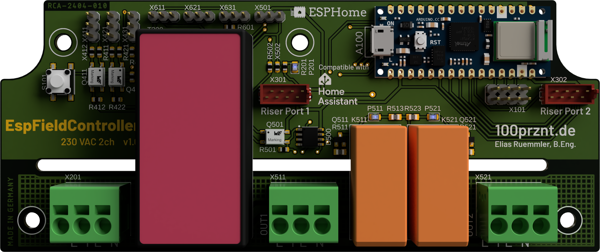
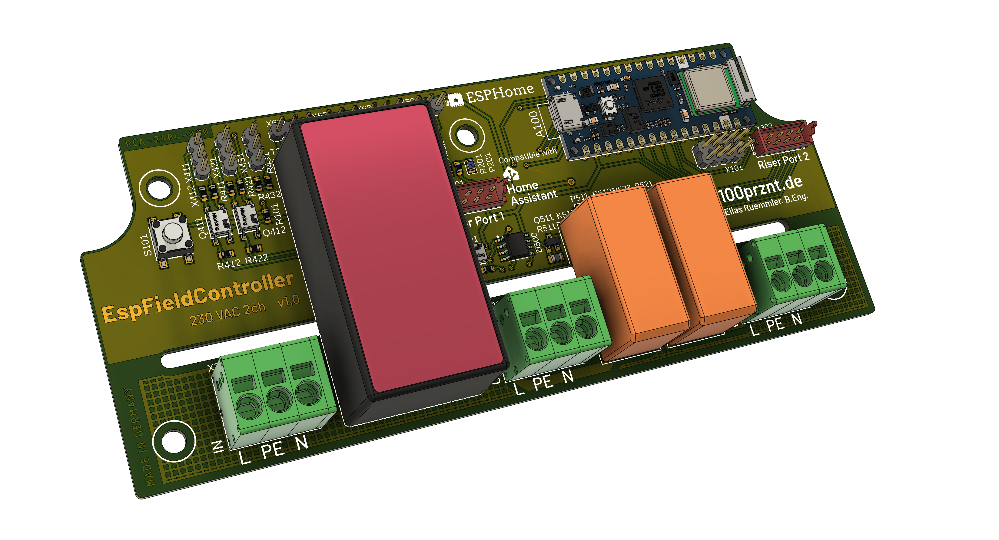

# EspFieldController
Modular aufgebauter Hardware-Controller für den Betrieb mit ESPHome.

## Onboard Funktionen

### ESP Board
* Arduino Nano ESP32 (NORA-W106-10B [ESP32-S3])
* Alternative (low-cost) Boards per individueller PCB (mapping auf Nano Footprint) 
#### Pinning

### Netzteil
* 230 VAC Netzklemme
* Versorgung von ESP und Peripherie
* 24 VDC (VEXT) und 5 VDC (VIN)
#### Auf Arduino Nano ESP
* Schutzdiode zwischen USB und VIN
* 3,3 VDC über linearen Spannungsregler

### Erweiterungsport
* 2 unabhängige Ports (EXT1 und EXT2)
* I2C (SCL, SDA)
* 2 GPIOs
* 24V
* 5V
* 3V3
* TE Micro-Match 8-pin

#### Pinning Micro-Match
| Pin |       | Funktion | GPIO   |
|-----|-------|----------|--------|
| 1  | Supply | +5 V     |        |
| 2  | Supply | +3.3 V   |        |
| 3  | IO     | EXT1_IO1 |        |
| 4  | IO     | EXT2_IO2 |        |
| 5  | I2C    | SDA      | GPIO11 |
| 6  | I2C    | SCL      | GPIO12 |
| 7  | 1-Wire | Data     | GPIO5  |
| 8  |        | GND      |        |

#### Standardpins
| ~D | GPIO | I2C | SPI         |
|----|------|-----|-------------|
| 21 | 11   | SDA |             |
| 22 | 12   | SCL |             |
| 10 | 21   |     | CS          |
| 11 | 38   |     | COPI (MOSI) |
| 12 | 47   |     | CIPO (MISO) |
| 13 | 48   |     | SCK         |

### Relais
* 2 unabhängige Kanäle
* 230 VAC 10 A (einpolig)
* 230 VAC Eingang über Netzklemme, L, N, PE (welche auch das Onboard Netzteil versorgt)
* Ausgangsklemmen inkl. N und PE
#### Safety Circuit
* Optional per eigenen Controller (alternativ per Jumper oder 0R gebrückt)
* Softwarefunktionen
  * Überwachung des ESP per Watchdog
  * Externe Freigabe per Enable Eingang (isoliert)
  * Verriegelung der Kanäle (inkl. Definition von Umschaltzeiten)
* Mögliche Controller
  * ATtiny25 (SOIC)
  * MSPM0C1104 (Cortex-M0+; SOT-23-THN)
 
##### Pinning
| Pin | Port | ATtiny25                               | Funktion    |
|-----|------|----------------------------------------|-------------|
| 1   | PB5  | PCINT5/RESET/ADC0/dW                   | Ext. Enable |
| 2   | PB3  | PCINT3/XTAL1/CLKI/OC1B/ADC3            | Ch1 Enable  |
| 3   | PB4  | PCINT4/XTAL2/CLKO/OC1B/ADC2            | Ch2 Enable  |
| 4   | GND  |                                        |             |
| 5   | PB0  | MOSI/DI/SDA/AIN0/OC0A/OC1A/AREF/PCINT0 | Watchdog    |
| 6   | PB1  | MISO/DO/AIN1/OC0B/OC1A/PCINT1          | Ch2 Out     |
| 7   | PB2  | SCK/USCK/SCL/ADC1/T0/INT0/PCINT2       | Ch1 Out     |
| 8   | VCC  |                                        |             |

### 1-Wire
* 3 Stecker auf einem Bus (2,54 mm Stiftleiste)

### Eingänge
* 2 digitale isolierte Eingänge
* 1 analoger Eingang

## GPIO Zuordnung

| GPIO | Funktion             | Funktionseinheit | Beschreibung |
|------|----------------------|------------------|--------------|
| 0    | LED green            |                  |              |
| 1    |                      | EXT1             |              |
| 2    |                      | EXT1             |              |
| 3    |                      | EXT2             |              |
| 4    |                      | EXT2             |              |
| 5    |                      | 1-Wire           |              |
| 6    |                      | Taster           |              |
| 7    |                      | Relais           | IN EN        |
| 8    |                      | Relais           | OUT Watchdog |
| 9    |                      | Relais           | OUT CH1      |
| 10   |                      | Relais           | OUT CH2      |
| 11   | I2C SDA              | EXT1 u. EXT2     |              |
| 12   | I2C SCL              | EXT1 u. EXT2     |              |
| 13   |                      | Eingang          |              |
| 14   |                      | Eingang          |              |
| 17   |                      | Analogeingang    |              |
| 18   |                      |                  |              |
| 21   |                      |                  |              |
| 38   | SPI COPI             |                  |              |
| 43   | UART RX0             |                  |              |
| 44   | UART TX0             |                  |              |
| 45   | LED blue             |                  |              |
| 46   | LED red              |                  |              |
| 47   | SPI CIPO             |                  |              |
| 48   | SPI SCK; LED_BUILDIN |                  |              |

