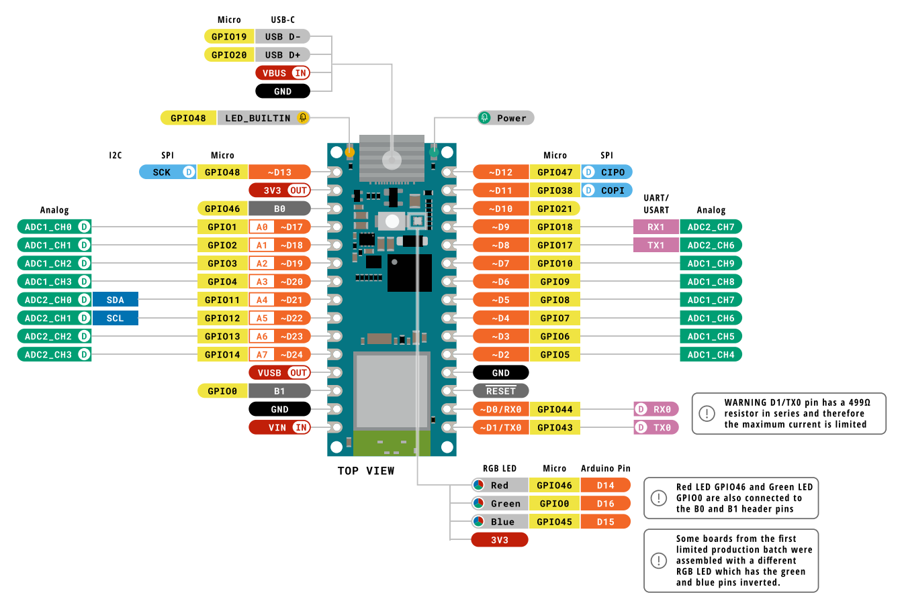

# ESP Field Controller
Modular aufgebauter Hardware-Controller für den Betrieb mit ESPHome.

Mit dem **ESP Field Controller** möchte ich eine Hardwarebasis für den Einsatz von ESPHome im "Außenbereich", also zumindest außerhab von Wohnräumen, schaffen. Eine wichtige Anforderung ist hier natürlich die [Schutzart](https://de.wikipedia.org/wiki/Schutzart). Daher wird der Controller in ein entsprechnd klassifiziertes Gehäuse montiert und verfügt auch über ein eigenes Netzteil. Basisfunktionalität, welche sehr oft benötigt wird, bringt der Controller selber mit. Für Anwendungen, welche etwas speziellere Features benötigen, lässt sich der Controller modular erweitern.

## Projektstatus
Nach einem ersten Prototyp-Aufbau auf dem Breadboard, folgt nun die erste PCB Revision. Hier ein fertiger **EspFieldController** mit gebrückter *Safety Circuit* und [WaterAnalyticRiser](WaterAnalyticRiser) *(WAR)*.

## Basisfunktionen

### Netzteil
* 230 VAC Netzklemme
* Versorgung von Arduino Nano ESP32 und Peripherie
* 5 VDC (VIN)
#### Auf Arduino Nano ESP32
* Schutzdiode zwischen USB und VIN
* 3,3 VDC über linearen Spannungsregler

### Eingänge
* 2 digitale Eingänge, per Optokoppler Isoliert (Spannung kann über Widerstandsnetzwerk individuell festgelegt werden)
* 1 digitaler Freigabeeingang für Safety Circuit, per Optokoppler Isoliert (Spannung kann über Widerstandsnetzwerk individuell festgelegt werden)
* 1 analoger Eingang (Spannungsbereich kann über Widerstandsnetzwerk individuell festgelegt werden)
* 1 Taster

### Ausgänge

#### Relais
* 2 unabhängige Kanäle
* 230 VAC 10 A (einpolig, Summenstrom nicht über 10 A)
* 230 VAC Eingang über Netzklemme, L, N, PE (welche auch das Netzteil versorgt)
* Ausgangsklemmen inkl. N und PE
##### Safety Circuit
* Optional per eigenen Controller (alternativ per 0R gebrückt)
* ATtiny25 (SOIC)
* Softwarefunktionen
  * Überwachung des ESP per Watchdog
  * Externe Freigabe per Enable Eingang (isoliert)
  * Verriegelung der Kanäle (inkl. Definition von Umschaltzeiten)
 
###### Pinning
| Pin | Port | ATtiny25                               | Funktion    |
|-----|------|----------------------------------------|-------------|
| 1   | PB5  | PCINT5/RESET/ADC0/dW                   | Ext. Enable |
| 2   | PB3  | PCINT3/XTAL1/CLKI/OC1B/ADC3            | Ch1 Enable  |
| 3   | PB4  | PCINT4/XTAL2/CLKO/OC1B/ADC2            | Ch2 Enable  |
| 4   | GND  |                                        |             |
| 5   | PB0  | MOSI/DI/SDA/AIN0/OC0A/OC1A/AREF/PCINT0 | Watchdog    |
| 6   | PB1  | MISO/DO/AIN1/OC0B/OC1A/PCINT1          | Ch2 Out     |
| 7   | PB2  | SCK/USCK/SCL/ADC1/T0/INT0/PCINT2       | Ch1 Out     |
| 8   | VCC  |                                        |             |

### 1-Wire
* 3 Stecker auf einem Bus (2,54 mm Stiftleiste)

### Riser-Ports

#### Pinning Micro-Match
| Pin |       | Funktion | GPIO   |
|-----|-------|----------|--------|
| 1  | Supply | +5 V     |        |
| 2  | Supply | +3.3 V   |        |
| 3  | IO     | EXT1_IO1 |        |
| 4  | IO     | EXT2_IO2 |        |
| 5  | I2C    | SDA      | GPIO11 |
| 6  | I2C    | SCL      | GPIO12 |
| 7  | 1-Wire | Data     | GPIO5  |
| 8  |        | GND      |        |

### ESP Board
* Arduino Nano ESP32 (NORA-W106-10B [ESP32-S3])
* Alternative (low-cost) Boards per individueller PCB (mapping auf Nano Footprint) 

#### Pinning

## GPIO Zuordnung
| GPIO | Funktion             | Funktionseinheit | Beschreibung |
|------|----------------------|------------------|--------------|
| 0    | LED green            |                  |              |
| 1    |                      | EXT1             |              |
| 2    |                      | EXT1             |              |
| 3    |                      | EXT2             |              |
| 4    |                      | EXT2             |              |
| 5    |                      | 1-Wire           |              |
| 6    |                      | Taster           |              |
| 7    |                      | Relais           | IN EN        |
| 8    |                      | Relais           | OUT Watchdog |
| 9    |                      | Relais           | OUT CH1      |
| 10   |                      | Relais           | OUT CH2      |
| 11   | I2C SDA              | EXT1 u. EXT2     |              |
| 12   | I2C SCL              | EXT1 u. EXT2     |              |
| 13   |                      | Eingang          |              |
| 14   |                      | Eingang          |              |
| 17   |                      | Analogeingang    |              |
| 18   |                      |                  |              |
| 21   |                      |                  |              |
| 38   | SPI COPI             |                  |              |
| 43   | UART RX0             |                  |              |
| 44   | UART TX0             |                  |              |
| 45   | LED blue             |                  |              |
| 46   | LED red              |                  |              |
| 47   | SPI CIPO             |                  |              |
| 48   | SPI SCK; LED_BUILDIN |                  |              |

#### Standardpins
| ~D | GPIO | I2C | SPI         |
|----|------|-----|-------------|
| 21 | 11   | SDA |             |
| 22 | 12   | SCL |             |
| 10 | 21   |     | CS          |
| 11 | 38   |     | COPI (MOSI) |
| 12 | 47   |     | CIPO (MISO) |
| 13 | 48   |     | SCK         |

## Feature Request (next version)
* Relais überwachen
  - Stromüberwachung
  - Sicherheitsrelais
* Rückmeldung Safety Cricuit an ESP
