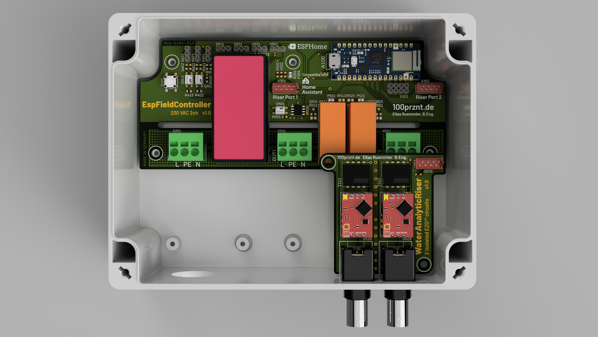

# Water Analytic Riser :sweat_drops:

Erweitert den [ESP Field Controller](../) um zwei EZO Circuit Sockel, welche die entsprechenden Module von Atlas Scientifics aufnehmen können.

## Anwendung

Die Idee hinter dem __Water Analytic Riser__ ist der Aufbau einer automatischen Pool-Dosiersteuerung. Hierzu ist es erforderlich den pH-Wert sowie das Redoxpotential (ORP) messtechnisch zu erfassen und entsprechende Dosierpumpen für Schwefelsäure (pH Senker) bzw. Natriumhypochlorit (Chlor) anzusteueren.
Über die ESPHome Konfiguration kann eine einfache Regelung eingerichtet werden, sodass die Dosierung der Chemie automatisch erfolgt und auch keine Host-Verbindung (Verbindung zu Home Assistant) erforderlich ist. Die entsprechenden Vorgabe- und Einstellwerte werden über Home Assistant konfiguriert und die Messwerte überwacht.

### Externe Hardware
* pH Elektrode
* Redox Elektrode
* Temperaturfühler (DS18B20) :link:
* Dosierpumpe für pH Senker :link:
* Dosierpumpe für Chlor :link:

:link: Anschluss am _ESP Field Controller__

## Funktionen

Um eine Potentialverschiebung an den eingesetzen Messelektroden zu vermeden, ist sowohl die Versorgungsspannung als auch der I2C Bus für jedes EZO Circuit isoliert ausgeführt. Die herausgeführten Elektrodenanschlüsse sind somit gegeneinander und gegen den ESP Field Controller isoliert, sowohl auf der Messleitung also auch auf der zugehörigen Masse.

* Isolierte Versorgungsspannung je EZO Sockel
* Isolierter I2C Bus je EZO Sockel

## Feature Request

* 1-Wire Stecker für DS18B20
* Taster für Kalibrierung
* Versorgunsspannung schaltbar (stand-by)
